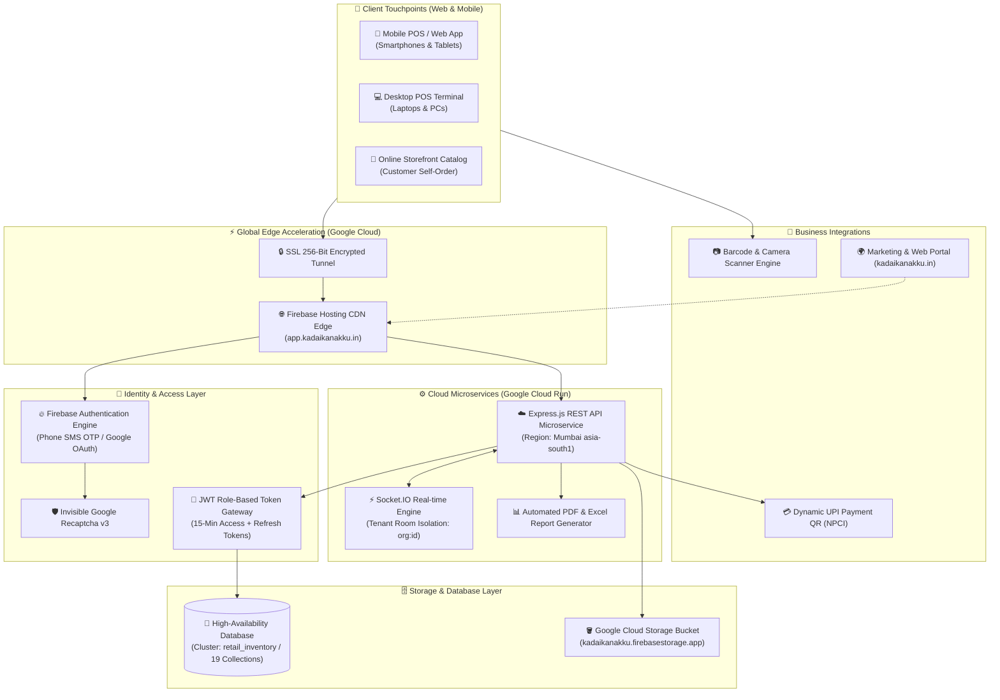
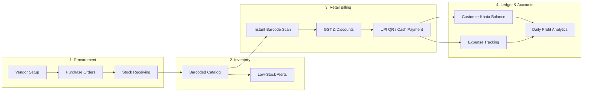
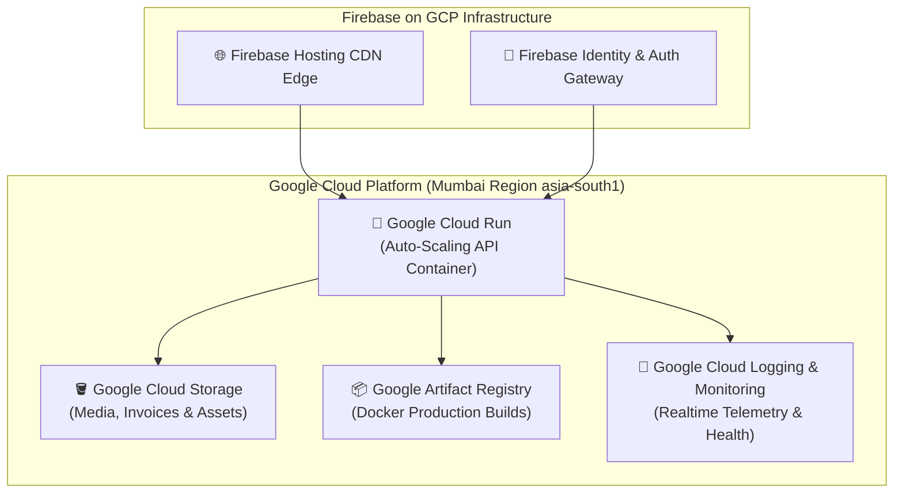
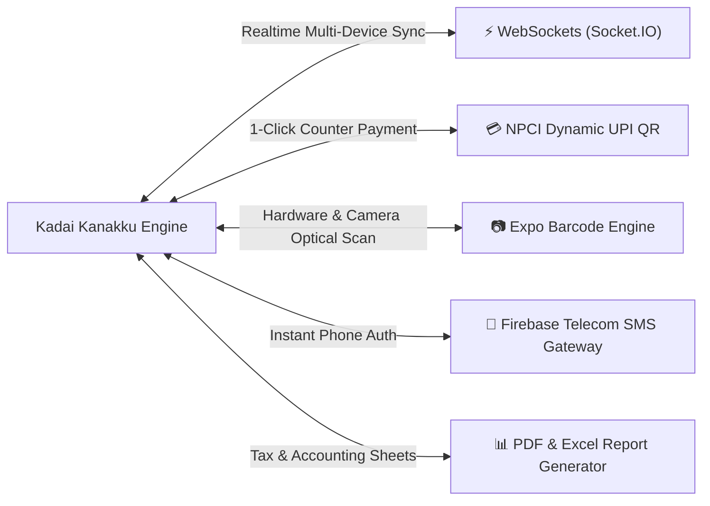
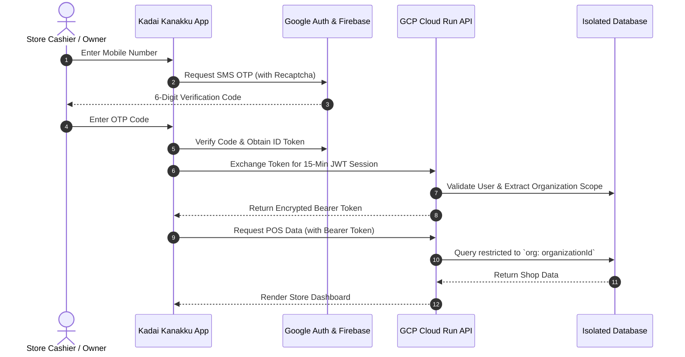

# 🛍️ Kadai Kanakku · Smart Cloud POS & Retail Management
## Complete Enterprise System Architecture & Client Technical Dossier

---

> [!NOTE]
> **Document Purpose:** This technical dossier provides an end-to-end overview of the **Kadai Kanakku** platform, detailing its core business modules, technical workflows, Google Cloud Platform (GCP) infrastructure, third-party integrations, and security frameworks for client presentation and enterprise evaluation.

---

## 📑 Executive Summary

**Kadai Kanakku** (கடை கணக்கு) is a high-performance, multi-tenant cloud Retail POS (Point of Sale), inventory automation, and store management platform designed for modern Indian retail enterprises, supermarkets, grocery chains, electronics outlets, and departmental stores. 

It provides instant sub-second barcode billing, live stock synchronization across devices, automated GST invoicing, customer khata credit tracking, supplier call logging, and profit-and-loss business intelligence.

---

## 🏗️ 1. End-to-End Enterprise Architecture

---

## 💼 2. Core Business Features & How the App Works

### 📦 Detailed Module Capabilities

| Module | Core Functionality | Business Impact |
| :--- | :--- | :--- |
| **🚀 Instant POS Billing** | • Sub-second barcode search & camera scanner. • Custom discount percentages and multi-tier tax calculation. • Instant thermal bill printing and digital receipt sharing. | Cuts counter billing wait time by **65%**. |
| **📦 Smart Inventory Management** | • Real-time stock decrement upon sale. • Automated low-stock thresholds and restock reminders. • Stock audit logs and manual adjustment tracking. | Eliminates out-of-stock and over-purchasing losses. |
| **📒 Customer Khata (Credit Ledger)** | • Complete record of customer credit and repayments. • Instant balance lookups and overdue reminders. • Customer transaction statement exports. | Recovers outstanding credit **2x faster**. |
| **🤝 Supplier & Vendor Procurement** | • Supplier purchase order generation. • Receiving workflows that automatically increment stock. • Vendor call and contact management logs. | Seamless vendor tracking without manual registers. |
| **💸 Shop Expense Tracking** | • Category-wise expense logging (Rent, Electricity, Salaries, Misc). • Daily, monthly, and yearly operational cost totals. | Clear visibility into operational overheads. |
| **📈 Profit & Tax Reports** | • Gross vs. Net Profit analytics. • Downloadable PDF invoices and Excel tax sheets. | 1-Click GST and accountant audit readiness. |

---

## ☁️ 3. Google Cloud Platform (GCP) Infrastructure Breakdown

The entire platform is architected natively on **Google Cloud Platform (GCP)** to ensure 99.99% uptime, sub-30ms latency in India, and infinite automatic scaling.

### 🛠️ Infrastructure Component Matrix

| Infrastructure Layer | Google Cloud Component | Technical Specs & Role |
| :--- | :--- | :--- |
| **Frontend CDN** | **Google Firebase Hosting** | Global multi-region edge caching with automated HTTP/2 and 256-bit SSL certificate provisioning. |
| **Backend Compute** | **Google Cloud Run** | Serverless microservice running in **Mumbai (`asia-south1`)** with automatic zero-to-twenty instance autoscaling. |
| **Media Storage** | **Google Cloud Storage (Firebase)** | High-durability object storage (`kadaikanakku.firebasestorage.app`) for product photos, receipts, and invoice PDFs. |
| **Identity & Security** | **Google Firebase Auth + IAM** | Telecom-grade SMS OTP routing with invisible reCAPTCHA anti-bot protection and Google OAuth 2.0. |
| **Container Registry** | **Google Artifact Registry** | Secure Docker image repository (`asia-south1-docker.pkg.dev`) storing immutable production releases. |
| **Telemetry & Auditing** | **Google Cloud Logging / Monitoring** | Centralized structured logging, error analytics, and latency tracking. |

---

## 🔌 4. Integrations & Protocols

1. **💳 Dynamic UPI Payments:** Instant generation of UPI QR codes on checkout counters linked to the shop merchant ID (`@okaxis`), enabling cashless payments with automatic verification.
2. **⚡ Real-Time Multi-Terminal Sync:** Powered by Socket.IO, enabling real-time stock updates across multiple cash registers, phone apps, and inventory terminals simultaneously.
3. **📷 Hardware & Camera Barcode Scanning:** Integrated with device cameras and Bluetooth/USB laser barcode scanners for rapid checkout.
4. **📊 Dual Report Exporter:** Direct server-side streaming of structured financial reports into **PDF format** (for printing) and **Excel `.xlsx`** (for accountant filing).

---

## 🔒 5. Enterprise Security & Multi-Tenant Data Isolation

> [!IMPORTANT]
> **Tenant Isolation Guarantee:** Every merchant store operates inside a dedicated cryptographic organization scope (`org:<organizationId>`). Cross-tenant data leaks are physically blocked at the database query and WebSocket room layers.

1. **Authentication Security:**
   - Stateless 15-minute JWT session tokens paired with secure HTTP-only refresh tokens.
   - Brute-force rate limiting enforced by `express-rate-limit` on all authentication endpoints.
2. **Data Protection:**
   - All network traffic forced over TLS 1.3 / HTTPS.
   - Passwords hashed using salted `bcrypt` algorithms.
   - Bank-grade database security with restricted IP whitelisting and encrypted connections.

---

## 📋 6. Production URLs & Verification Matrix

| Service | Target Domain / Live URL | Infrastructure Layer | SLA / Health |
| :--- | :--- | :--- | :--- |
| **Merchant POS Web App** | [https://app.kadaikanakku.in/](https://app.kadaikanakku.in/) | Firebase Hosting CDN + Web App | **Live (200 OK)** |
| **Default Global CDN** | [https://app-kadaikanakku.web.app/](https://app-kadaikanakku.web.app/) | Firebase Default CDN URL | **Live (200 OK)** |
| **Backend REST API** | `https://kadaikanakku-api-775937258064.asia-south1.run.app` | Google Cloud Run (Mumbai `asia-south1`) | **Live (200 OK)** |
| **Public Portal & Landing** | [https://kadaikanakku.in/](https://kadaikanakku.in/) | Google Cloud Run + Firebase Edge | **Live (200 OK)** |
| **Cloud File Storage** | `gs://kadaikanakku.firebasestorage.app` | Google Cloud Storage Bucket | **Live (200 OK)** |

---

*© 2026 Kadai Kanakku. All Rights Reserved. Engineered for High-Reliability Retail Cloud Operations.*
